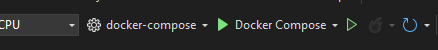

> This text was originally written in [this repo](https://github.com/OscarBennich/docker-tips-and-tricks)

## Debugging .NET Docker containers locally together with existing Docker compose stack
The way we "normally" debug .NET applications is using either a locally running [IIS Express web server](https://learn.microsoft.com/en-us/iis/extensions/introduction-to-iis-express/iis-express-overview) instance (for .NET Framework) or a locally running [Kestrel web server](https://learn.microsoft.com/en-us/aspnet/core/fundamentals/servers/kestrel?view=aspnetcore-8.0) instance. But, it is also possible do this for a .NET application with Docker support by [debugging the locally running container](https://learn.microsoft.com/en-us/visualstudio/containers/edit-and-refresh?view=vs-2022).

There is however an issue if this locally running Docker container needs to access other processes running as containers as part of a Docker compose stack. In this case the Docker container you are debugging won't be able to reach the other containers in the same way it would if it was part of the same stack. But there is a solution to this!

To get this to work you need to:
- Add a docker-compose file to your project.
  - You need to add the "build" part of the configuration and point to the local Dockerfile because we don't want to build the container using a remote image from something like Docker Hub or Azure Container Registry (ACR). 
  - In the `docker-compose.yml` file in the application you want to debug, make sure it can reach the docker compose network by adding a "networks" element and mapping the container specification to this. 

    The name of the network we map to will match the name of the compose stack. So in this case we have a pre-existing docker compose network called "my-cool-docker-compose-stack". 
    
    See ["Use a pre-existing network"](https://docs.docker.com/compose/how-tos/networking/#use-a-pre-existing-network).
  - I also chose to give the container a different name too, to make it clear what is being run. E.g. "my_cool_app.local.debug"

```yml
services:
  my_cool_app:
    container_name: my_cool_app.local.debug
    build:
      context: .
      dockerfile: MyCoolApp/Dockerfile
    ports:
      - "000001:8080"
    environment:
      - ASPNETCORE_ENVIRONMENT=Development
    extra_hosts:
      # Mapping the localhost for the container to the host machine
      # (this is optional and should only be done if necessary)
      - "localhost:host-gateway"
    networks:
      - my-cool-docker-compose-stack_default

# For the Docker containers to run as expected when debugging them locally we need to make sure that the "docker-compose-stack" network is reachable by the containers.
# This network is created by the "my-cool-docker-compose-stack" docker-compose stack (or whatever you choose to call it) and all other containers run on this network.
networks:
  my-cool-docker-compose-stack_default:
    external: true

```
- Add a `.dcproj` file to your .NET solution and point to the docker-compose file you created. Add this project to your .NET solution.

```yml
<?xml version="1.0" encoding="utf-8"?>
<Project ToolsVersion="15.0" Sdk="Microsoft.Docker.Sdk">
  <PropertyGroup Label="Globals">
    <ProjectVersion>2.1</ProjectVersion>
    <DockerTargetOS>Linux</DockerTargetOS>
    <ProjectGuid>4a7a1559-96ca-439e-af78-36321a4ed8dd</ProjectGuid>
    <DockerComposeProjectName>my_cool_app.local.debug</DockerComposeProjectName>
    <DockerLaunchAction>LaunchBrowser</DockerLaunchAction>
    <DockerServiceUrl>{Scheme}://localhost:{ServicePort}/swagger</DockerServiceUrl>
    <!-- Specify which service/container to use when launching browser -->
    <DockerServiceName>my_cool_app</DockerServiceName>
  </PropertyGroup>
  <ItemGroup>
    <None Include="docker-compose.yml" />
    <None Include=".dockerignore" />
  </ItemGroup>
</Project>
```

- Add a `<DockerComposeProjectPath>` to your `.csproj` file

```xml
    <DockerDefaultTargetOS>Linux</DockerDefaultTargetOS>
    <DockerComposeProjectPath>..\docker-compose.dcproj</DockerComposeProjectPath>
```

- Set the docker-compose project as a Startup project:

  

What this means is that after setting up the original Docker compose stack stack you can seamlessly switch out one or more containers to instead run using a local Dockerfile and debug them through Visual Studio. While debugging, the container has access to all other containers in the stack as expected. After you are done debugging you can switch back to having it running in the background (manually starting and stopping the container in Docker Desktop).
