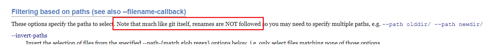

> This text was originally written in [this repo](https://github.com/OscarBennich/windows-terminal-setup-how-to)

## How to split code from a repository into a new one and only keep relevant history

Expanded from [these instructions](https://docs.github.com/en/get-started/using-git/splitting-a-subfolder-out-into-a-new-repository). *[Here](https://github.com/newren/git-filter-repo) you can find the repo for the Git-filter-repo tool.*

1. Follow [these instructions](https://github.com/newren/git-filter-repo/blob/main/INSTALL.md) and download the `git-filter-repo` script and put it somewhere on your machine - also make sure you have Python installed.
2. Create a new branch in the repo you want to move
3. Make a fresh clone of the repo from this branch (a fresh clone is required for the `git-filter-repo` tool):

   ```
   git clone --single-branch --branch {{BRANCHNAME}} {{ORIGINAL-REPO-ADDRESS}}
   ```

4. Figure out what folders & files that need to be moved to the new repo
   > Note: If you move a specific file, any folder(s) it is part of will be automatically added
5. Open the [script](GitMove-MultiPath.ps1) in the root of this repo and add the path(s) from the root of the cloned repo to the files and folders
   > Note: Windows users should use '/' to delimit folders (**not** '\\')
7. CD into the cloned repo and run the script from inside it:

   ```
   .\{{RELATIVE-PATH-TO-UTILITY-SCRIPT}} {{PATH-TO-GIT-FILTER-REPO-SCRIPT}}
   ```

   For example:

   ```
   .\..\GitMove-MultiPath.ps1 C:\Users\my-user\source\repos\test\git-filter-repo
   ```

8. Create a new repository
9. Push these changes to the new remote:

   ```
   git push {{NEW-REPO-ADDRESS}} {{BRANCH-NAME}}
   ```

10. Create a `main` branch from this branch in the new repo, delete the old branch in the new remote
11. Set up build validation, policies, etc.

> This new repository will contain only the relevant commit history for the files you chose to include
>
> Keep in mind that the commit hashes **will be changed**
>
> Also note that renames are NOT followed, meaning that if a file has moved into the folder you are filtering out, then the commit history before the move will be gone (unless you include the previous file location too) 
> 
> 
> https://htmlpreview.github.io/?https://github.com/newren/git-filter-repo/blob/docs/html/git-filter-repo.html


Optional:

- Delete the files in the old repo and push these changes to the trunk if you do not want to keep the files in both repos

## How to duplicate a repository without forking it

If you want to create a new repository from the contents of an existing repository but don't want to merge your changes to the upstream in the future, you shouldn't fork it but instead _duplicate_ it.

Go [here](https://docs.github.com/en/repositories/creating-and-managing-repositories/duplicating-a-repository) or [here](https://www.atlassian.com/git/tutorials/git-move-repository) for specific instructions on how to do this.

## Git hooks
See https://git-scm.com/book/ms/v2/Customizing-Git-Git-Hooks

1. Add a script that will be executed
2. Either manually add this hook to the correct `.git/hooks` folder or execute it through a script such as this (PowerShell in this case):

```ps1
# This scripts installs a "precommit hook" for this repo, so that the script ./scripts/Pre-Commit.ps1 will
# always run when the developer runs `git commit` without the `--no-verify` flag

Set-StrictMode -Version 3.0
$ErrorActionPreference = "Stop"

$hookPath = git rev-parse --git-path hooks

$sourceFile = Join-Path $PSScriptRoot pre-commit-hook

Write-Host "Copying the hook source file to $hookPath"

Copy-Item $sourceFile $hookPath/pre-commit
```

## Using `--no-pager` and setting git `pager` settings to false
1. `git --no-pager diff`
2. `git config --global pager.diff false`
3. `git config --global pager.log false`

## Using `git add -p` to stage specific hunks

## Wildcard search for branches
- `git branch --list *search term*`

## Editing a specific commit
1. Get the git hash by running `git log`
2. Double check using `git show {{HASH}}`
3. Run `git rebase --i {{HASH}}~`
4. Choose to edit the commit
5. Commit your new changes
6. Run `git rebase --continue`

(copied from [this post](https://stackoverflow.com/a/1186549))

## Adding message/reminder to stashed code
- `git stash push -m 'Message goes here'`
